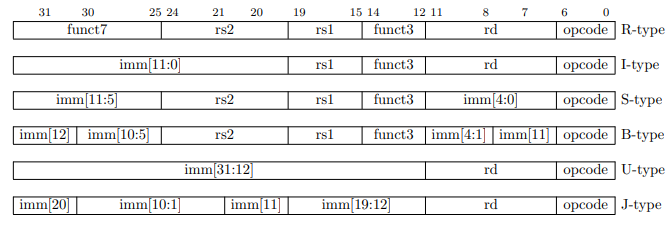
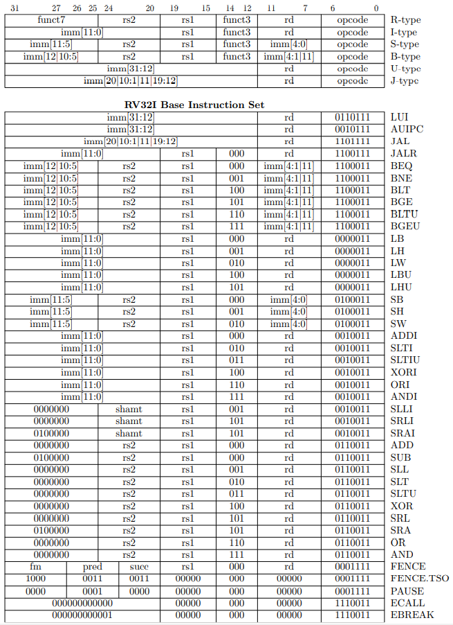

# RV32E
---
# _RV-Summary | rvalp_

### The describe architecture is a RISC-V	architecture	with	the	following	features:	

- 16 general-purpose registers (x0–x15), where x0 is a dedicated zero register. When read, its value is always 0x00000000. 	Whenever there is an attempt to write to x0, the data is simply discarded.
- Registers are 32 bits wide.
- There is a program counter (PC) register 32 bits wide.	
- Little endian architecture.
- Multiply and divide instructions are not present	
- “Control and Status Registers” (CSRs)	
- Single and double precision Floating point instructions are not present	
- Atomic instructions are not present

```sh
Jump    	Unconditional change
Branch  	Conditional change
```

Register  | ABI         | Use by convention                     | Preserved?
:-------- | :---------- | :---------------                      | ------
x0        | zero        | hardwired to 0, ignores writes        | _n/a_
x1        | ra          | return address for jumps              | no
x2        | sp          | stack pointer                         | yes
x3        | gp          | global pointer                        | _n/a_
x4        | tp          | thread pointer                        | _n/a_
x5        | t0          | temporary register 0                  | no
x6        | t1          | temporary register 1                  | no
x7        | t2          | temporary register 2                  | no
x8        | s0 _or_ fp  | saved register 0 _or_ frame pointer   | yes
x9        | s1          | saved register 1                      | yes
x10       | a0          | return value _or_ function argument 0 | no
x11       | a1          | return value _or_ function argument 1 | no
x12       | a2          | function argument 2                   | no
x13       | a3          | function argument 3                   | no
x14       | a4          | function argument 4                   | no
x15       | a5          | function argument 5                   | no
x16       | a6          | function argument 6                   | no
x17       | a7          | function argument 7                   | no
x18       | s2          | saved register 2                      | yes
x19       | s3          | saved register 3                      | yes
x20       | s4          | saved register 4                      | yes
x21       | s5          | saved register 5                      | yes
x22       | s6          | saved register 6                      | yes
x23       | s7          | saved register 7                      | yes
x24       | s8          | saved register 8                      | yes
x25       | s9          | saved register 9                      | yes
x26       | s10         | saved register 10                     | yes
x27       | s11         | saved register 11                     | yes
x28       | t3          | temporary register 3                  | no
x29       | t4          | temporary register 4                  | no
x30       | t5          | temporary register 5                  | no
x31       | t6          | temporary register 6                  | no
pc        | _(none)_    | program counter                       | _n/a_


# instruction	formats:	

##  R-type	instructions:	
	 	 Operands:	
	 	 	 RegD,Reg1,Reg2	
	 	 Example:	
    ADD x4,x6,x8 # x4 = x6+x8
##  I-type	instructions:	
	 	 Operands:	
	 	 	 RegD,Reg1,Immed-12	
	 	 Examples:	
    ADDI x4,x6,123 # x4 = x6+123
    LW x4,8(x6) # x4 = Mem[8+x6]
##  S-type	instructions:	
	 	 Operands:	
	 	 	 Reg1,Reg2,Immed-12	
	 	 Example:	
    SW x4,8(x6) # Mem[8+r6] = x4 (word)
##  B-type	instructions	(a	variant	of	S-type):	
	 	 Operands:	
	 	 	 Reg1,Reg2,Immed-12	
	 	 Example:	
    blt x4,x6,loop # if x4<x6, goto offset(pc)

The only difference between S-type and B-type instructions is how the 12-bit immediate value is handled. In an B-type instruction, the immediate value is multiplied by 2 (i.e., shifted left 1 bit) before being used. In the S-type instruction, the value is not shifted. 
In both cases, sign-extension occurs. In particular, the bits to the left are synthesized by 2illing them in with a copy of the most signi2icant bit actually present.

## S-type immediate values: 
	Actual value used (where s=sign-extension): 
		ssss ssss ssss ssss ssss VVVV VVVV VVVV 
	Range of values: 
		-2,048 .. +2,047 
		0xFFFFF800 .. 0x000007FF

## B-type immediate values:	
	Actual value used (where s=sign-extension): 
		ssss ssss ssss ssss sssV VVVV VVVV VVV0
	Range of values: 
		-4,096 .. +4,094 (in multiples of 2) 
		0xFFFFF000 .. 0x00000FFE 


##  U-type	instructions:	
	 	 Operands:	
	 	 	 RegD,Immed-20	
	 	 Example:	
    LUI x4,0x12AB7 # x4 = value<<12
    AUIPC x4,0x12AB7 # x4 = (value<<12) + pc
##  J-type	instructions	(a	variant	of	U-type):	
	 	 Operands:	
	 	 	 RegD,Immed-20	
	 	 Example:	
    jal x4,foo # call: pc=offset+pc; x4=ret addr

The only difference between U-type and J-type instructions is how the 20-bit immediate value is handled. In a U-type instruction, the immediate value is shifted left by 12 bits to give a 32 bit value. In other words, the immediate value is placed in the uppermost 20 bits, and the lower 12 bits are zero-2illed. 

## U-type immediate values: 
	Actual value used: 
		VVVV VVVV VVVV VVVV VVVV 0000 0000 0000
	The value is always aligned to a multiple of 4,096. 

## J-type immediate values:	
	Actual value used (where s=sign-extension): 
		ssss ssss sssV VVVV VVVV VVVV VVVV VVV0
	Range of values: 
		-1,048,576 .. +1,048,574 (in multiples of 2)
		0xFFF00000 .. 0x000FFFFE

---

Next, we give the encodings for the different types of instructions. In the following, each letter represents a single bit, according to the following legend:

DDDDD = RegD 
11111 = Reg1 
22222 = Reg2 
VVVVV = Immediate value 
XXXXX = Op-code / function code 

## R-type instructions: 
	Operands: 
		RegD,Reg1,Reg2 
	Encoding: 
		XXXX XXX2 2222 1111 1XXX DDDD DXXX XXXX 
## I-type instructions: 
	Operands: 
		RegD,Reg1,Immed-12 
	Encoding: 
		VVVV VVVV VVVV 1111 1XXX DDDD DXXX XXXX 
## S-type and B-type instructions: 
	Operands: 
		Reg1,Reg2,Immed-12 
	Encoding: 
		VVVV VVV2 2222 1111 1XXX VVVV VXXX XXXX 
## U-type and J-type instructions: 
	Operands: 
		RegD,Immed-20 
	Encoding: 
		VVVV VVVV VVVV VVVV VVVV DDDD DXXX XXXX



## Instructions

| Instruction | Type | Description | RTL |
| ------ | ------ | ------ | ------ |
add rd, rs1, rs2 | R | Add | rd ← rs1 + rs2, pc ← pc+4
addi rd, rs1, imm | I | Add Immediate | rd ← rs1 + imm i, pc ← pc+4
and rd, rs1, rs2 | R | And | rd ← rs1 & rs2, pc ← pc+4
andi rd, rs1, imm | I | And Immediate | rd ← rs1 & imm i, pc ← pc+4
auipc rd, imm | U | Add Upper Immediate to PC | rd ← pc + imm u, pc ← pc+4 ,  page59
beq rs1, rs2, pcrel 13 | B | Branch Equal | pc ← pc + ((rs1==rs2) ? imm b : 4) ,  page65
bge rs1, rs2, pcrel 13 | B | Branch Greater or Equal | pc ← pc + ((rs1>=rs2) ? imm b : 4) ,  page68
bgeu rs1, rs2, pcrel 13 | B | Branch Greater or Equal Unsigned | pc ← pc + ((rs1>=rs2) ? imm b : 4) ,page70
blt rs1, rs2, pcrel 13 | B | Branch Less Than (Signed) | pc ← pc + ((rs1<rs2) ? imm b : 4)
bltu rs1, rs2, pcrel 13 | B | Branch Less Than Unsigned | pc ← pc + ((rs1<rs2) ? imm b : 4) ,  page69
bne rs1, rs2, pcrel 13 | B | Branch Not Equal | pc ← pc + ((rs1!=rs2) ? imm b : 4) ,  page67
jal rd, pcrel 21 | J | Jump And Link | rd ← pc+4, pc ← pc+imm j ,  page71
jalr rd, imm(rs1) | I | Jump And Link Register | rd ← pc+4, pc ← (rs1+imm i)&~1 ,  page73
lb rd, imm(rs1) | I | Load Byte | rd ← sx(m8(rs1+imm i)), pc ← pc+4 ,  page78
lbu rd, imm(rs1) | I | Load Byte Unsigned | rd ← zx(m8(rs1+imm i)), pc ← pc+4 ,  page78
lh rd, imm(rs1) | I | Load Halfword | rd ← sx(m16(rs1+imm i)), pc ← pc+4
lhu rd, imm(rs1) | I | Load Halfword Unsigned | rd ← zx(m16(rs1+imm i)), pc ← pc+4
lui rd, imm | U | Load Upper Immediate | rd ← imm u, pc ← pc+4 , page52 
lw rd, imm(rs1) | I | Load Word | rd ← sx(m32(rs1+imm i)), pc ← pc+4 , page 80
or rd, rs1, rs2 | R | Or | rd ← rs1 | rs2, pc ← pc+4 , page 50
ori rd, rs1, imm | I | Or Immediate | rd ← rs1 | imm i, pc ← pc+4
sb rs2, imm(rs1) | S | Store Byte | m8(rs1+imm s) ← rs2[7:0], pc ← pc+4 , page 83
sh rs2, imm(rs1) | S | Store Halfword | m16(rs1+imm s) ← rs2[15:0], pc ← pc+4 , page 84
sll rd, rs1, rs2 | R | Shift Left Logical | rd ← rs1 << (rs2%XLEN), pc ← pc+4 , page52
slli rd, rs1, shamt | I | Shift Left Logical Immediate | rd ← rs1 << shamt i, pc ← pc+4
slt rd, rs1, rs2 | R | Set If Less Than (Signed) | rd ← (rs1 < rs2) ? 1 : 0, pc ← pc+4 , page 61
slti rd, rs1, imm | I | Set Less Than Immediate (Signed) | rd ← (rs1 < imm i) ? 1 : 0, pc ← pc+4
sltiu rd, rs1, imm | I | Set Less Than Immediate Unsigned | rd ← (rs1 < imm i) ? 1 : 0, pc ← pc+4 , Page 62
sltu rd, rs1, rs2 | R | Set If Less Than (Unsigned) | rd ← (rs1 < rs2) ? 1 : 0, pc ← pc+4
sra rd, rs1, rs2 | R | Shift Right Arithmetic | rd ← rs1 >> (rs2%XLEN), pc ← pc+4 , page54
srai rd, rs1, shamt | I | Shift Right Arithmetic Immediate | rd ← rs1 >> shamt i, pc ← pc+4 , page54
srl rd, rs1, rs2 | R | Shift Right Logical | rd ← rs1 >> (rs2%XLEN), pc ← pc+4 , page53 
srli rd, rs1, shamt | I | Shift Right Logical Immediate | rd ← rs1 >> shamt i, pc ← pc+4
sub rd, rs1, rs2 | R | Subtract | rd ← rs1 - rs2, pc ← pc+4
sw rs2, imm(rs1) | S | Store Word | m32(rs1+imm s) ← rs2[31:0], pc ← pc+4 , page 85
xor rd, rs1, rs2 | R | Exclusive Or | rd ← rs1 ^ rs2, pc ← pc+4
xori rd, rs1, imm | I | Exclusive Or Immediate | rd ← rs1 ^ imm i, pc ← pc+4

## Special Instructions

| Instruction | Operation | Description |
| ------ | ------ | ------ |
neg rd,rs2 | Negate | NEG x4,x9  , x4 = -x9  This is a special case of a more general instruction. This instruction is assembled identically to: SUB RegD,x0,Reg
not rd,rs1 | Not | NOT x4,x9  , x4 = ~x9  , This is a special case of a more general instruction. This instruction is assembled identically to: XORI RegD,Reg1,-1 # Note that -1 = 0xFFFFFFFF
nop | Nop | NOP  , #Do nothing   , This is a special case of a more general instruction. This instruction is assembled identically to: ADDI x0,x0,0 
mv rd,rs1 | Move | MV x4,x9 , x4 = x9  , This is a special case of a more general instruction. This instruction is assembled identically to: ADDI x4,x9,0 
LI rd,Immed-32 | Load Immediate | LI x4,123 , x4 = 0x0000007B  , This is a special case of more general instructions and is assembled differently depending on the actual value present. If the immediate value is in the range of -2,048 .. +2,047, then it can be assembled identically to: ADDI RegD,x0,Immed If the immediate value is not within the range of -2,048 .. +2,047 but is within the range of a 32-bit number (i.e., -2,147,483,648 .. +2,147,483,647) then it can be assembled using this two-instruction sequence: LUI RegD,Upper-20 ADDI RegD,RegD,Lower-12 where “Upper-20” represents the uppermost 20 bits of the value and“Lower-12” represents the least signi2icant 12-bits of the value. Page 59 
LA rd,Address | Load Address | LA x4,MyVar # x4 = &MyVar, There is no actual “load address” instruction; instead the assembler substitutes a sequence of two instructions to achieve the same effect. The “address” can refer to any location within the 32-bit memory space. The address is converted to a PC-relative address, with an offset of 32 bits. This offset is then broken into two pieces: a 20-bit piece and a 12-bit piece. The instruction is assembled using these two instructions: AUIPC RegD,Upper-20 ADDI RegD,RegD,Lower-12. Page 60 
SGT RegD,Reg1,Reg2 | Set If Greater Than (Signed) | SGT x4,x9,x13 # x4 = (x9>x13) ? 1 : 0  This is a special case of a different instruction. This instruction is assembled identically to: SLT RegD,Reg2,Reg1 # Note: regs are switched. The contents of Reg1 is compared to the contents of Reg2 using signed comparison. If the value in Reg1 is greater than the value in Reg2, the value 1 is stored in RegD. Otherwise, the value 0 is stored in RegD. Page 62
SGTU RegD,Reg1,Reg2 | Set If Greater Than (UnSigned) | SGTU x4,x9,x13 # x4 = (x9>x13) ? 1 : 0  This is a special case of a different instruction. This instruction is assembled identically to: SLTU RegD,Reg2,Reg1 # Note: regs are switched. The contents of Reg1 is compared to the contents of Reg2 using unsigned comparison. If the value in Reg1 is greater than the value in Reg2, the value 1 is stored in RegD. Otherwise, the value 0 is stored in RegD. Page 63
SEQZ RegD,Reg1 | Set If Equal To Zero | SEQZ x4,x9 # x4 = (x9==0) ? 1 : 0. This is a special case of a more general instruction. This instruction is assembled identically to: SLTIU RegD,Reg1,1. This instruction is implemented with an unsigned comparison against 1. Using unsigned numbers, the only value less than 1 is 0. Therefore if the less-than condition holds, the value in Reg1 must be 0. If the value in Reg1 is zero, the value 1 is stored in RegD. Otherwise, the value 0 is stored in RegD. Page 63
SNEZ RegD,Reg2 | Set If Not Equal To Zero | SNEZ x4,x9 # x4 = (x9≠0) ? 1 : 0. This is a special case of a more general instruction. This instruction is assembled identically to: SLTU RegD,x0,Reg2. This instruction is implemented with an unsigned comparison against 0. Using unsigned numbers, the only value not less than 0 is 0. Therefore if the lessthan condition holds, the value in Reg2 must be not be 0. If the value in Reg2 is not zero, the value 1 is stored in RegD. Otherwise, the value 0 is stored in RegD. Page 63
SLTZ RegD,Reg1 | Set If Less Than Zero (signed) | SLTZ x4,x9 # x4 = (x9<0) ? 1 : 0. This is a special case of a more general instruction. This instruction is assembled identically to: SLT RegD,Reg1,x0. If the value in Reg1 is less than zero (using signed arithmetic), the value 1 is stored in RegD. Otherwise, the value 0 is stored in RegD. Page 64
SGTZ RegD,Reg1 | Set If Greater Than Zero (signed) | SGTZ x4,x9 # x4 = (x9>0) ? 1 : 0. This is a special case of a more general instruction. This instruction is assembled identically to: SLT RegD,x0,Reg2. This is a special case of a more general instruction. This instruction is assembled identically to: SLT RegD,x0,Reg2. Page 64
BLE Reg1,Reg2,Immed-12 | Branch if Less Than Or Equal (Signed) | BLE x4,x9,MyLabel # If x4<=x9 goto MyLabel. This is a special case of another instruction. This instruction is assembled identically to: BGE Reg2,Reg1,Immed-12 # Note: regs are swapped. The contents of Reg1 is compared to the contents of Reg2. If Reg1 is less than or equal to Reg2 (using signed comparison), control jumps to a PC-relative target address.
BGT Reg1,Reg2,Immed-12 | Branch if Greater Than (Signed) | BGT x4,x9,MyLabel # If x4>x9 goto MyLabel. This is a special case of another instruction. This instruction is assembled identically to: BLT Reg2,Reg1,Immed-12 # Note: regs are swapped. The contents of Reg1 is compared to the contents of Reg2. If Reg1 is greater than Reg2 (using signed comparison), control jumps to a PC-relative target address. 
BLEU Reg1,Reg2,Immed-12 | Branch if Less Than Or Equal (Unsigned) | BLEU x4,x9,MyLabel # If x4<=x9 goto MyLabel. This is a special case of another instruction. This instruction is assembled identically to: BGEU Reg2,Reg1,Immed-12 # Note: regs are swapped. The contents of Reg1 is compared to the contents of Reg2. If Reg1 is less than or equal to Reg2 (using unsigned comparison), control jumps to a PC-relative target address. 
BGTU Reg1,Reg2,Immed-12 | Branch if Greater Than (Unsigned) | BGTU x4,x9,MyLabel # If x4>x9 goto MyLabel. This is a special case of another instruction. This instruction is assembled identically to: BLTU Reg2,Reg1,Immed-12 # Note: regs are swapped. The contents of Reg1 is compared to the contents of Reg2. If Reg1 is greater than Reg2 (using unsigned comparison), control jumps to a PC-relative target address.
J Immed-20 | Jump (Short-Distance) | J MyLabel # Goto MyLabel. This is a special case of another instruction. This instruction is assembled identically to: JAL x0,Immed-20 # Discard return address. The target address is given as a PC-relative offset. The effective range is ±1 MiByte, i.e., -1,048,576 .. 1,048,574 (in multiples of 2), relative to the PC. Page 73
JR Reg1 | Jump Register | JR Reg1 # Goto *Reg1, i.e., PC = Reg1. This is a special case of another instruction. This instruction is assembled identically to: JALR x0,Reg1,0 # Discard ret addr; offset=0. Jump to the address in Reg1. Page 73
RET | Return | RET # Goto *x1, i.e., PC = x1. This is a special case of another instruction. This instruction is assembled identically to: JALR x0,x1,0 # PC=x1+0; don’t save prev PC. By convention, x1 is used as the “link register” and will hold a return address. This instruction returns from a subroutine/function. Page 74
CALL Immed-32 | Call Faraway Subroutine | CALL MyFunct # PC = new addr; x1 = ret addr. In order to deal with the larger distance to the subroutine, this “synthetic” instruction will be assembled using the following two-instruction sequence. The target address can be expressed as a 32-bit offset from the Program Counter. This offset is broken into two pieces, which are added to the PC in two steps. AUIPC x6,Immed-20 JALR x1,x6,Immed-12 The AUIPC instruction adds the PC to the upper 20-bit portion of the 32-bit offset and places the result in a temporary register. The JALR instruction adds in the lower 12 bits of the 32-bit offset and transfers control by loading the sum into the PC. It also saves the return address in x1. The CALL instruction makes use of the convention that x1 is the link register. It also uses x6, which is a “caller-saved temporary register” by convention. By convention, x1 is used as the “link register” and will hold a return address. This instruction calls a subroutine/function using a PC-relative scheme, where the subroutine offset from the CALL instruction exceeds the 20-bit limit (i.e., ±1 MiByte) of the JAL instruction. This instruction modi2ies register x6. Page 75
TAIL Immed-32 | Tail Call (Faraway Subroutine) / Long-Distance Jump | TAIL MyFunct # PC = new addr; Discard ret addr. This instruction is used to jump to a distant location using a PC-relative scheme, where the displacement from the TAIL instruction to the target instruction exceeds the 20-bit limit (i.e., ±1 MiByte) of the J instruction (jump short distance). This instruction modi2ies register x6. This “synthetic” instruction will be assembled using the following twoinstruction sequence. AUIPC x6,Immed-20 JALR x0,x6,Immed-12 See the comments for the CALL instruction. The only difference is that here the return address is discarded (x0), instead of being saved in x1. Page 77


----

## A listing of standard RISC-V pseudoinstructions

Pseudoinstruction            | Base Instruction(s)                                           | Meaning   | Comment
:----------------------------|:--------------------------------------------------------------|:----------|:--------|
la rd, symbol                | auipc rd, symbol[31:12]; addi rd, rd, symbol[11:0]            | Load address
l{b\|h\|w\|d} rd, symbol     | auipc rd, symbol[31:12]; l{b\|h\|w\|d} rd, symbol[11:0]\(rd\) | Load global
s{b\|h\|w\|d} rd, symbol, rt | auipc rt, symbol[31:12]; s{b\|h\|w\|d} rd, symbol[11:0]\(rt\) | Store global
fl{w\|d} rd, symbol, rt      | auipc rt, symbol[31:12]; fl{w\|d} rd, symbol[11:0]\(rt\)      | Floating-point load global
fs{w\|d} rd, symbol, rt      | auipc rt, symbol[31:12]; fs{w\|d} rd, symbol[11:0]\(rt\)      | Floating-point store global
nop                          | addi x0, x0, 0                                                | No operation
li rd, immediate             | *Myriad sequences*                                            | Load immediate
mv rd, rs                    | addi rd, rs, 0                                                | Copy register
not rd, rs                   | xori rd, rs, -1                                               | Ones’ complement
neg rd, rs                   | sub rd, x0, rs                                                | Two’s complement
negw rd, rs                  | subw rd, x0, rs                                               | Two’s complement word
sext.b rd, rs                | slli rd, rs, XLEN - 8; srai rd, rd, XLEN - 8                  | Sign extend byte | It will expand to another instruction sequence when B extension is available*[1]
sext.h rd, rs                | slli rd, rs, XLEN - 16; srai rd, rd, XLEN - 16                | Sign extend half word | It will expand to another instruction sequence when B extension is available*[1]
sext.w rd, rs                | addiw rd, rs, 0                                               | Sign extend word
zext.b rd, rs                | andi rd, rs, 255                                              | Zero extend byte
zext.h rd, rs                | slli rd, rs, XLEN - 16; srli rd, rd, XLEN - 16                | Zero extend half word | It will expand to another instruction sequence when B extension is available*[1]
zext.w rd, rs                | slli rd, rs, XLEN - 32; srli rd, rd, XLEN - 32                | Zero extend word | It will expand to another instruction sequence when B extension is available*[1]
seqz rd, rs                  | sltiu rd, rs, 1                                               | Set if = zero
snez rd, rs                  | sltu rd, x0, rs                                               | Set if != zero
sltz rd, rs                  | slt rd, rs, x0                                                | Set if < zero
sgtz rd, rs                  | slt rd, x0, rs                                                | Set if > zero
fmv.s rd, rs                 | fsgnj.s rd, rs, rs                                            | Copy single-precision register
fabs.s rd, rs                | fsgnjx.s rd, rs, rs                                           | Single-precision absolute value
fneg.s rd, rs                | fsgnjn.s rd, rs, rs                                           | Single-precision negate
fmv.d rd, rs                 | fsgnj.d rd, rs, rs                                            | Copy double-precision register
fabs.d rd, rs                | fsgnjx.d rd, rs, rs                                           | Double-precision absolute value
fneg.d rd, rs                | fsgnjn.d rd, rs, rs                                           | Double-precision negate
beqz rs, offset              | beq rs, x0, offset                                            | Branch if = zero
bnez rs, offset              | bne rs, x0, offset                                            | Branch if != zero
blez rs, offset              | bge x0, rs, offset                                            | Branch if ≤ zero
bgez rs, offset              | bge rs, x0, offset                                            | Branch if ≥ zero
bltz rs, offset              | blt rs, x0, offset                                            | Branch if < zero
bgtz rs, offset              | blt x0, rs, offset                                            | Branch if > zero
bgt rs, rt, offset           | blt rt, rs, offset                                            | Branch if >
ble rs, rt, offset           | bge rt, rs, offset                                            | Branch if ≤
bgtu rs, rt, offset          | bltu rt, rs, offset                                           | Branch if >, unsigned
bleu rs, rt, offset          | bgeu rt, rs, offset                                           | Branch if ≤, unsigned
j offset                     | jal x0, offset                                                | Jump
jal offset                   | jal x1, offset                                                | Jump and link
jr rs                        | jalr x0, rs, 0                                                | Jump register
jalr rs                      | jalr x1, rs, 0                                                | Jump and link register
ret                          | jalr x0, x1, 0                                                | Return from subroutine
call offset                  | auipc x6, offset[31:12]; jalr x1, x6, offset[11:0]            | Call far-away subroutine
tail offset                  | auipc x6, offset[31:12]; jalr x0, x6, offset[11:0]            | Tail call far-away subroutine
fence                        | fence iorw, iorw                                              | Fence on all memory and I/O

